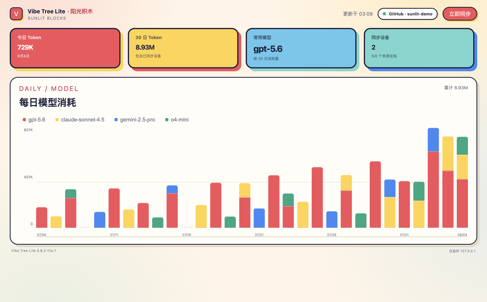
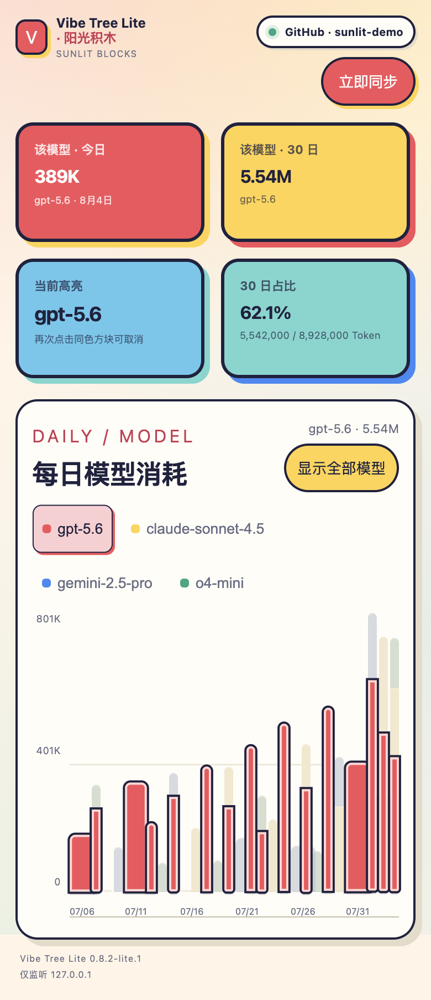

# Vibe Tree Lite · Sunlit Blocks

[简体中文](README.md) | English

A local token dashboard and multi-device sync service without Electron. Only a Node.js process stays in the background; the browser is used to view data. Token collection and GitHub cloud sync continue after the page is closed.



> Screenshots use synthetic demo data and contain no real account or token usage information.

## What stays

- Local usage watchers for Codex, Claude Code, OpenClaw, Pi Agent, OpenCode, Gemini, Hermes, and Kimi Code.
- Today, recent 30-day, and all-time token totals.
- A 30-day daily bar chart stacked by model.
- Clickable model legends and chart blocks for highlighting, filtering, and inspecting each model's share.
- Aggregate token sync between macOS and Windows through the same GitHub account.
- The original Vibe Tree local history and cloud-sync protocol.

Lite does not include the desktop tree, weather, levels, achievements, share cards, leaderboard page, or Electron/Chromium renderer processes.

### Narrow-screen layout



## Requirements

- Node.js 22 or newer
- Git
- macOS or Windows

## Install on macOS

Quit the Electron version of Vibe Tree first, then run:

```bash
git clone https://github.com/bzbj/vibe-tree-lite.git
cd vibe-tree-lite
npm ci
npm run install:lite:mac
```

Open <http://127.0.0.1:47831>. The installer registers a per-user LaunchAgent so Lite starts at login. It does not delete the original app or existing token history.

Update to the latest version:

```bash
cd vibe-tree-lite
git pull --ff-only
npm ci
npm run install:lite:mac
```

Remove the background service while preserving token data:

```bash
npm run uninstall:lite:mac
```

## Install on Windows

Run in PowerShell:

```powershell
git clone https://github.com/bzbj/vibe-tree-lite.git
Set-Location .\vibe-tree-lite
npm.cmd ci
powershell.exe -NoProfile -ExecutionPolicy Bypass -File .\scripts\install-lite-windows.ps1
```

The installer places the Electron-free runtime under `%LOCALAPPDATA%\VibeTreeLite`, registers a current-user scheduled task, and creates a Start menu shortcut.

Update to the latest version:

```powershell
Set-Location .\vibe-tree-lite
git pull --ff-only
npm.cmd ci
powershell.exe -NoProfile -ExecutionPolicy Bypass -File .\scripts\install-lite-windows.ps1
```

Remove the task and shortcut while preserving token data:

```powershell
powershell.exe -NoProfile -ExecutionPolicy Bypass -File .\scripts\uninstall-lite-windows.ps1
```

## GitHub sync across devices

1. Install Lite and open the local page on every device.
2. Select **Use GitHub to sign in** and finish authorization in the browser.
3. Use the same GitHub account on both devices. Lite automatically joins existing cloud data, or starts from the local device when none exists.
4. When the top bar shows `GitHub · username`, select **Sync now** to check manually; background sync also runs on a schedule.

Sync contains token aggregates grouped by day, device, source, and model. Code, prompts, replies, conversation text, and local paths are not uploaded. See [PRIVACY.md](PRIVACY.md) for details.

## Supported sources

| Agent | Default source |
| --- | --- |
| Codex | `~/.codex/sessions/**/*.jsonl` |
| Claude Code | `~/.claude/projects/**/*.jsonl` |
| OpenClaw | `~/.openclaw/agents/**/sessions/*.jsonl` |
| Pi Agent | `~/.pi/agent/sessions/**/*.jsonl` |
| OpenCode | `~/.local/share/opencode/opencode.db`, with legacy JSON support |
| Gemini | local Gemini session directory |
| Hermes | local Hermes session directory |
| Kimi Code | `~/.kimi-code/sessions/**/wire.jsonl` |

Available sources are detected automatically. Do not run Electron Vibe Tree and Vibe Tree Lite at the same time: both use the same watcher offsets and event file.

## Run manually and validate

To run in the current terminal without installing a background service:

```bash
npm ci
npm run build:lite
npm run start:lite
```

Project checks:

```bash
npm run test:lite
npm run typecheck
```

See [LITE.md](LITE.md) for port, data-directory, and self-hosted sync configuration.

## Security boundary

- HTTP listens only on `127.0.0.1`.
- Mutating requests require a random page token and same-origin request.
- Page APIs do not expose the GitHub bearer token, device ID, local paths, or other users' profiles.
- Lite reuses the original Vibe Tree data directory by default; updates and uninstallers do not delete history.

## License

MIT
